## Performance Benchmarks

> Machine: `` — Linux 6.1.0-43-amd64  
> Python `3.11.2` — 2026-03-15

### Full pipeline: HTML to PDF

| Document | FerroPDF | WeasyPrint | wkhtmltopdf | Speedup vs WeasyPrint |
|---|---|---|---|---|
| **Simple HTML** | 271 µs +/-12 µs | 16.5 ms +/-935 µs | 495.6 ms +/-46.0 ms | **60.7x faster** |
| **Styled HTML** | 402 µs +/-29 µs | 32.1 ms +/-4.5 ms | 484.9 ms +/-44.7 ms | **79.9x faster** |
| **Table  10 rows** | 1.5 ms +/-116 µs | 111.1 ms +/-10.2 ms | 490.4 ms +/-58.1 ms | **71.8x faster** |
| **Table  50 rows** | 6.2 ms +/-1.3 ms | 388.3 ms +/-26.9 ms | 493.0 ms +/-59.2 ms | **62.5x faster** |
| **Table 100 rows** | 10.3 ms +/-965 µs | 807.8 ms +/-98.9 ms | 541.0 ms +/-39.7 ms | **78.1x faster** |

### Visual comparison (mean render time in ms — lower is better)

```mermaid
xychart-beta
    title "HTML → PDF render time (ms) — lower is better"
    x-axis ["Simple HTML", "Styled HTML", "Table 10 rows", "Table 50 rows", "Table 100 rows"]
    y-axis "Time (ms)"
    bar [0.271, 0.402, 1.547, 6.209, 10.349]
    bar [16.459, 32.126, 111.057, 388.258, 807.807]
    bar [495.648, 484.939, 490.413, 492.953, 540.970]
```

> **Series order (left → right per group):** FerroPDF · WeasyPrint · wkhtmltopdf

> 1 warm-up run + N timed iterations. Mean +/- stdev shown.
> Reproduce: `python benchmarks/benchmark_comparison.py`